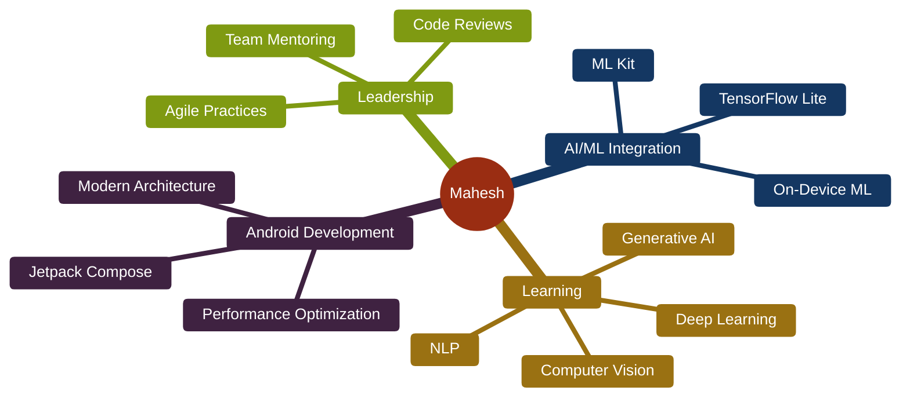

<div align="center">

<!-- Animated Header with Gradient -->


<!-- Animated Divider -->


<!-- Typing Animation -->


<br/>
<br/>

<!-- Social Badges with Icons -->
[](https://linkedin.com/in/mahesh-kumar-prajapati)
[](https://github.com/MaheshKumarPrajapati)
[](mailto:maheshprajapati1990@gmail.com)

<br/>

<!-- Profile Views Counter -->


</div>

---

## 🚀 About Me

> **Senior Tech Lead | Android Expert | AI/ML Explorer**

I'm a passionate **Android Developer** with **11+ years** of experience building scalable, enterprise-grade mobile applications. Currently expanding my expertise into **Artificial Intelligence & Machine Learning** while pursuing MTech at **BITS Pilani**.

🎯 **What I Do:**
- 🏗️ Architect and develop **enterprise Android applications** for telecom, GIS, and on-demand services
- 🤖 Explore **AI/ML integration** in mobile apps - bringing intelligence to user experiences  
- 👥 Lead cross-functional teams using **Agile/Scrum** methodologies
- 📈 Optimize app performance, reduce crashes, and enhance user satisfaction
- 🎓 Mentor developers and promote clean code practices

🌱 **Currently Learning:**
- Deep Neural Networks & Computer Vision
- Natural Language Processing
- Generative AI & LLMs
- PyTorch, TensorFlow, and OpenCV

<div align="center">

</div>

---

## 💼 Professional Journey

<details open>
<summary><b>🎯 Senior Tech Lead @ HCLTech Ltd.</b> (Jan 2022 - Present)</summary>

**Client:** Verizon, New Jersey

- 📱 Developed **DMAT** - Device Monitoring and Analytics Tool for 5G/LTE networks
- 🐛 Reduced critical bugs by **40%** through proactive code reviews and testing
- 🚀 Implemented key features: Instant Reports, Custom Tabs, AutoTest Module
- 📊 Managed crash analytics and market issue resolution

**Tech Stack:** `Kotlin` `Coroutines` `SQLite` `REST APIs` `Firebase` `MVVM`

</details>

<details>
<summary><b>👨‍💼 Team Lead @ Infoicon Technologies</b> (Mar 2020 - Jan 2022)</summary>

**Client:** LE34, Copenhagen Denmark

- 🗺️ Led development of **GIS-based applications** (SmartSurvey, FieldGIS, Borgertip)
- 🎨 Enhanced data accuracy and user experience through stakeholder collaboration
- ⚙️ Managed agile sprints, deliverables, and software releases
- 🏆 **Best Employee Award** for exceptional contributions

**Tech Stack:** `Kotlin` `MVVM` `Room` `Mapbox` `Coroutines` `Koin`

</details>

<details>
<summary><b>💻 Software Engineer @ Kommlabs Dezign</b> (Feb 2018 - Jan 2020)</summary>

**Product:** Yego Rwanda & Yego Kenya (Taxi-Hailing)

- 🚕 Built driver and passenger apps with **1L+ downloads** and **4.7★** rating
- ⚡ Optimized real-time location tracking and ride-matching algorithms
- 📲 Enhanced app performance for emerging markets

**Tech Stack:** `Java` `Kotlin` `MVVM` `RxJava` `gRPC` `Google Maps`

</details>

<details>
<summary><b>🔧 Android Developer @ Grepix Infotech</b> (Sep 2014 - Feb 2018)</summary>

- 📱 Developed **20+ applications** across multiple domains
- 🛒 E-commerce, ride-hailing, media streaming, real-time chat
- 🎯 Delivered scalable solutions meeting strict quality standards

**Tech Stack:** `Java` `REST/SOAP APIs` `SQLite` `Payment Gateways`

</details>

---

## 🛠️ Tech Stack & Skills

<div align="center">

### **Mobile Development**


<br/>


### **Architecture & Patterns**


### **AI/ML & Data Science**


<br/>


### **Tools & Technologies**


<br/>


### **AI Development Tools**


### **Maps & Location**


</div>

---

## 📊 GitHub Analytics

<div align="center">
  
<!-- GitHub Stats Cards -->


<!-- GitHub Streak -->


<!-- GitHub Activity Graph -->


<!-- Trophy Stats -->


</div>

---


## 🏆 Notable Projects

### 📱 **DMAT - Device Monitoring & Analysis Tool**
Enterprise application for analyzing 5G/LTE network performance  
**Tech:** Kotlin, Coroutines, SQLite, REST API, Firebase  
🔗 [Learn More](https://www.verizon.com/support/dmat-app/)

### 🚕 **Yego Kenya/Rwanda** 
Taxi-hailing apps with **100K+ downloads** | **4.7★** rating  
**Tech:** Kotlin, MVVM, RxJava, gRPC, Google Maps  
🔗 [Kenya](https://play.google.com/store/apps/details?id=com.yego.passenger) | [Rwanda](https://play.google.com/store/apps/details?id=rw.ac.yego)

### 🗺️ **SmartSurvey**
GIS-based point cloud creation application  
**Tech:** Kotlin, MVVM, Room, Mapbox, Coroutines  
🔗 [Google Play](https://play.google.com/store/apps/details?id=dk.le34.smartsurvey)

### 📍 **Hillerød Borgertip**
Municipal damage reporting with map integration  
**Tech:** Kotlin, Room, Mapbox, Firebase  
🔗 [Google Play](https://play.google.com/store/apps/details?id=dk.hillerod.borgertip)

### 🌍 **FieldGIS**
Field data collection with customizable forms  
**Tech:** Java, SQLite, OpenStreetMap  
🔗 [Google Play](https://play.google.com/store/apps/details?id=dk.le34.fieldgis)

---


## 🎓 Education

### 🎯 **MTech in Artificial Intelligence & Machine Learning**
**BITS Pilani** | Expected: September 2026  
*Work Integrated Learning Program*

**Coursework:**
- Machine Learning & Deep Neural Networks
- Natural Language Processing
- Computer Vision
- Generative AI

### 💻 **Master of Computer Applications (MCA)**
**Dr. APJ Abdul Kalam Technical University** | 2010 - 2013  
Industrial Training: Java/J2EE at Own Network Pvt. Ltd.

### 📚 **B.Sc. in Mathematics**
**Bundelkhand University** | 2007 - 2010

---


## 🌟 What Sets Me Apart

<div align="center">

</div>

<br/>

```kotlin
class MaheshPrajapati : TechLead, AIEnthusiast {
    
    val expertise = listOf(
        "11.5+ years Android development experience",
        "Enterprise-scale application architecture",
        "Team leadership & mentoring",
        "Agile/Scrum methodologies"
    )
    
    val aiJourney = mapOf(
        "current" to "MTech in AI/ML at BITS Pilani",
        "skills" to listOf("PyTorch", "TensorFlow", "OpenCV", "NLP", "Computer Vision"),
        "goal" to "Build AI-powered mobile solutions"
    )
    
    fun myMission() = """
        Combining deep Android expertise with cutting-edge AI/ML 
        to create intelligent, scalable mobile applications that 
        solve real-world problems and delight users.
    """.trimIndent()
    
    val achievements = listOf(
        "Best Employee Award - Infoicon Technologies",
        "100K+ downloads on Yego apps",
        "Led teams at HCLTech, Infoicon, Kommlabs",
        "20+ successful app deployments"
    )
}
```

---

## 📈 Career Highlights

<div align="center">

| 🎯 Metric | 📊 Achievement |
|-----------|----------------|
| **Experience** | 11+ Years |
| **Apps Developed** | 20+ |
| **Downloads** | 100K+ (3 Apps) |
| **Team Size Led** | 5-10 Members |
| **Industries** | Telecom, GIS, On-Demand Texi, Chat, Music/Video Streaming |
| **App Rating** | 4.7★ Average |

</div>

---


## 💡 Current Focus




---


## 🤝 Let's Connect!

<div align="center">

</div>

<br/>

I'm always open to discussing:
- 🚀 **Android Development** best practices
- 🤖 **AI/ML Integration** in mobile apps
- 👥 **Team Leadership** and Agile methodologies
- 💼 **Collaboration** opportunities
- 🎓 **Mentorship** for aspiring developers

### 📫 Reach Out

<div align="center">

[](https://linkedin.com/in/mahesh-kumar-prajapati)
[](mailto:maheshprajapati1990@gmail.com)

</div>

---

## 📌 Fun Facts

- 🎂 Born: April 20, 1990
- 📍 Location: Noida, India
- 💬 Languages: English, Hindi
- ⚡ From building taxi apps to exploring neural networks
- 🎯 Goal: Bridge the gap between mobile development and AI

---

<div align="center">

### 💭 *"Code is like humor. When you have to explain it, it's bad."* - Cory House

<br/>

### Thanks for visiting! 🙏


</div>
